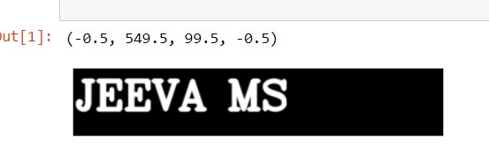
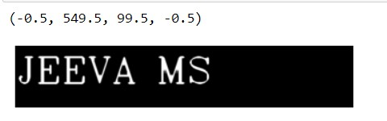
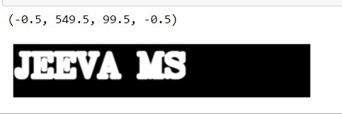

# Implementation-of-Erosion-and-Dilation
## Aim
To implement Erosion and Dilation using Python and OpenCV.
## Software Required
1. Anaconda - Python 3.7
2. OpenCV
## Algorithm:
### Step1:
Import the necessary packages to do Erosion and Dilution.
<br>


### Step2:
Create the text image of our name using putText from cv2 package.
<br>

### Step3:
Create the required structural element.
<br>

### Step4:
Apply Erode and Dilution for the image.
<br>

### Step5:
Display the output images.
<br>


### Step6:
End the program.

 
## Program:
```

# Import the necessary packages
import cv2
import numpy as np
import matplotlib.pyplot as plt

# Create the Text using cv2.putText
img1=np.zeros((100,550),dtype='uint8')
font = cv2.FONT_HERSHEY_PLAIN = 3
cv2.putText(img1,'JEEVA MS',(3,60),font,2,(255),5,cv2.LINE_AA)
plt.imshow(img1,'gray')
plt.axis('off')

# Create the structuring element
kernel=np.ones((5,5),np.uint8)

# Erode the image
image_erode1=cv2.erode(img1,kernel)
plt.imshow(image_erode1,'gray')
plt.axis('off')

# Dilate the image
image_dilatel=cv2.dilate(img1,kernel)
plt.imshow(image_dilatel,'gray')
plt.axis('off')


```
## Output:

### Display the input Image

<br>
<br>
<br>
<br>
<br>
<br>

### Display the Eroded Image

<br>
<br>
<br>
<br>
<br>
<br>

### Display the Dilated Image

<br>
<br>
<br>
<br>
<br>
<br>

## Result
Thus the generated text image is eroded and dilated using python and OpenCV.